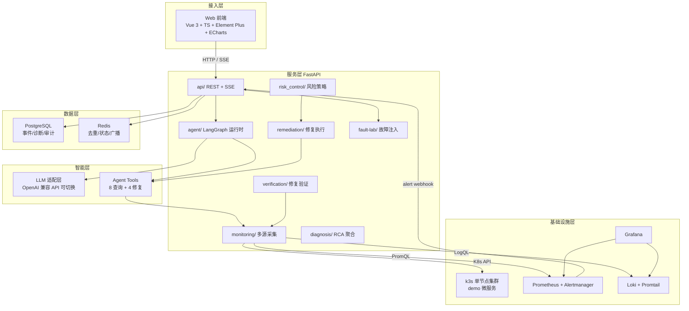
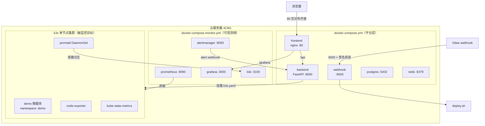
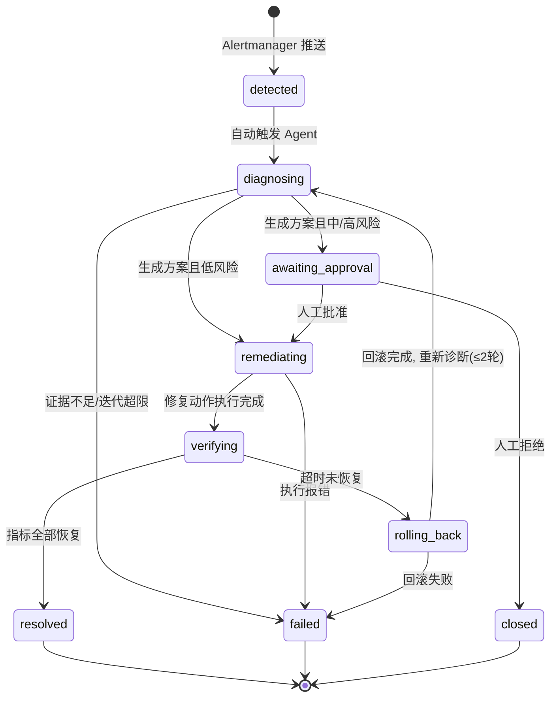
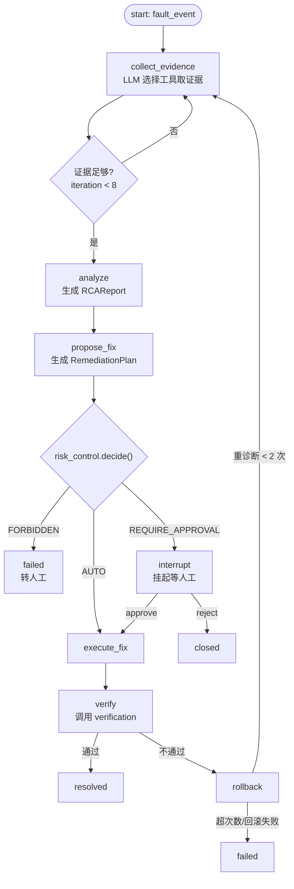
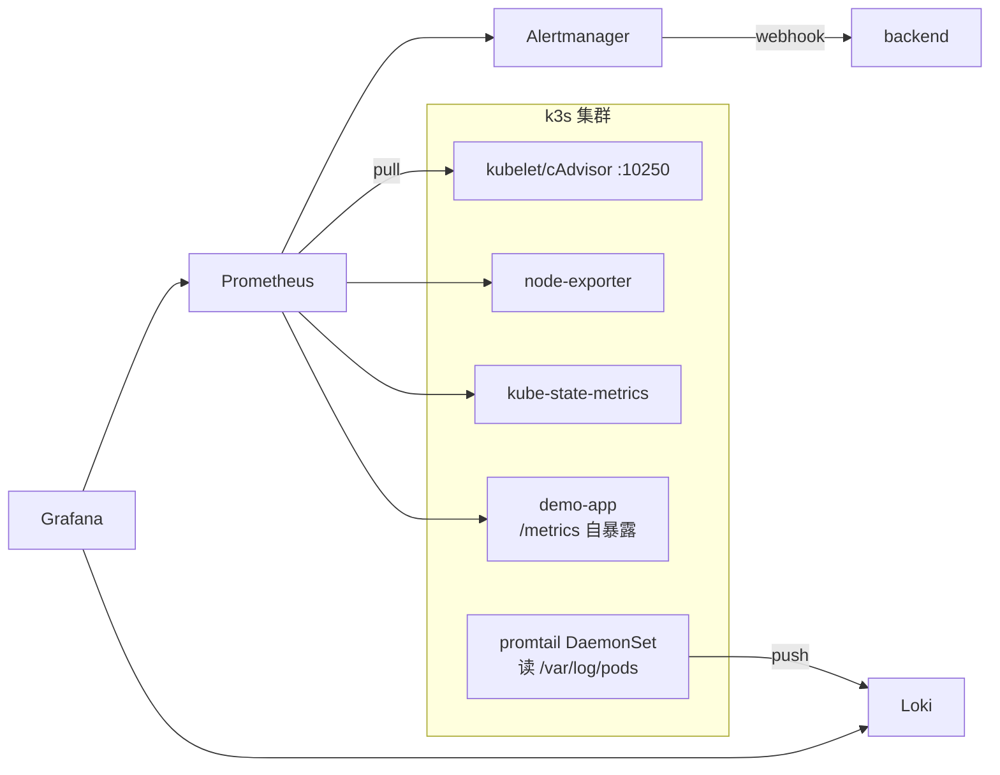

# KAIROS 架构设计文档

> 开发用工程文档。目标读者是本项目开发者自己，重实现细节：模块接口、关键流程、状态机、数据结构。
> 项目定位与目标见根目录 [README.md](../README.md)，本文不重复。

---

## 目录

1. [系统概述](#1-系统概述)
2. [总体架构](#2-总体架构)
3. [部署架构](#3-部署架构)
4. [故障感知层](#4-故障感知层)
5. [故障事件状态机](#5-故障事件状态机)
6. [后端模块设计](#6-后端模块设计)
7. [AI Agent 架构](#7-ai-agent-架构)
8. [数据架构](#8-数据架构)
9. [可观测性架构](#9-可观测性架构)
10. [故障实验室](#10-故障实验室)
11. [风险控制与安全](#11-风险控制与安全)
12. [API 概要](#12-api-概要)
13. [目录结构](#13-目录结构)
14. [技术选型理由](#14-技术选型理由)

---

## 1. 系统概述

KAIROS 是一个基于 Kubernetes + Prometheus + Loki + LLM Agent 的智能运维系统，实现完整故障闭环：

```text
故障发现 → 信息采集 → 根因分析 → 修复方案 → 风险评估 → 执行修复 → 修复验证 → 成功 / 回滚
```

三条设计原则，全文所有模块围绕它们展开：

| 原则 | 含义 | 落点 |
|---|---|---|
| 证据驱动 | AI 结论必须附带可核验的证据链，禁止凭经验直接下结论 | `diagnosis/` RCA 契约（§6.4） |
| 风险分级 | 每个 K8s 操作有风险等级，等级决定自动执行 / 人工确认 / 禁止 | `risk_control/` 策略表（§11.1） |
| 闭环自愈 | 修复后必须验证指标恢复，不达标自动回滚并重新诊断 | `verification/` 检查规则（§6.7） |

核心术语：

- **fault_event（故障事件）**：一次故障从发现到结束的完整生命周期载体，核心实体。
- **evidence（证据）**：Agent 通过工具调用取得的一条信息（Pod 状态、日志片段、指标曲线数据等）。
- **RCA（Root Cause Analysis）**：基于证据的根因分析结论，固定 JSON 结构。
- **remediation（修复动作）**：对 K8s 的一次变更操作。
- **experiment（实验）**：故障实验室主动注入的一次故障，用于量化评估。

---

## 2. 总体架构



分层职责：

| 层 | 职责 | 关键约束 |
|---|---|---|
| 接入层 | 展示、人工确认交互、实时诊断过程流 | 不做业务判断，只消费 SSE |
| 服务层 | 全部业务逻辑：采集、诊断、修复、验证 | 所有 K8s 写操作必经 risk_control |
| 智能层 | LLM 调用、工具执行 | LLM 不直接持有 K8s 凭证，只能通过工具 |
| 数据层 | 持久化 + 实时状态 | 写操作全量进审计表 |
| 基础设施层 | 被监控集群与可观测组件 | 与平台层容器隔离 |

---

## 3. 部署架构

单台云服务器（推荐 4C8G，Ubuntu 22.04 + Docker），三层结构：



要点：

- **网络边界**：公网只开 `22 / 80 / 9000`（9000 建议在云安全组限制 Gitee 来源 IP）。Prometheus、Loki、PostgreSQL、Redis、backend 全部只在 compose 内网/本机，需要看 Grafana 走 nginx 反代，需要查监控数据走 SSH 隧道。
- **backend 连集群**：backend 跑在 compose（集群外），部署时挂载宿主机 `/etc/rancher/k3s/k3s.yaml` 到容器并设置 `KUBECONFIG`，启动脚本把其中 `server: https://127.0.0.1:6443` 改写为 `https://<宿主机内网IP>:6443`（容器内 127.0.0.1 不通）。
- **双 compose 拆分**：平台层与可观测栈独立启停互不牵连；低配机器（2C4G 降级）可以只跑平台层，监控栈最小化。
- **服务器目录约定**：

```text
/opt/kairos/
├── repo/                # 项目仓库（CI/CD 在此 pull + build）
├── kubeconfig/k3s.yaml  # 改写好 server 地址的副本
└── data/                # 持久卷
    ├── postgres/  ├── prometheus/  ├── grafana/  └── loki/
```

---

## 4. 故障感知层

采用 **Prometheus 告警规则 + Alertmanager webhook 推送**，backend 不轮询。

### 4.1 告警规则（rules.yml 要点）

| 告警名 | PromQL 要点 | for | 级别 |
|---|---|---|---|
| PodCrashLooping | `increase(kube_pod_container_status_restarts_total[10m]) > 3` | 1m | warning |
| PodOOMKilled | `increase(kube_pod_container_status_last_terminated_reason{reason="OOMKilled"}[10m]) > 0` | 0m | critical |
| ContainerMemoryHigh | `container_memory_working_set_bytes / kube_pod_container_resource_limits{resource="memory"} > 0.95` | 3m | warning |
| ContainerCPUHigh | `rate(container_cpu_usage_seconds_total[5m]) / kube_pod_container_resource_limits{resource="cpu"} > 0.9` | 5m | warning |
| HTTPErrorRateHigh | `sum(rate(demo_http_requests_total{status=~"5.."}[5m])) / sum(rate(demo_http_requests_total[5m])) > 0.05` | 2m | critical |
| HTTPLatencyHigh | `histogram_quantile(0.95, sum by (le)(rate(demo_http_request_duration_seconds_bucket[5m]))) > 2` | 3m | warning |
| NodeNotReady | `kube_node_status_condition{condition="Ready",status="true"} == 0` | 1m | critical |

表达式以 kube-state-metrics / cAdvisor 实际指标名为准，落地时逐条验证。demo 应用需暴露 `demo_http_requests_total`、`demo_http_request_duration_seconds_bucket` 两个指标。

### 4.2 Alertmanager 路由

```yaml
route:
  receiver: kairos-backend
  group_by: [alertname, namespace, pod]
  group_wait: 10s        # 聚合抖动内的重复告警
  group_interval: 30s
  repeat_interval: 30m
receivers:
  - name: kairos-backend
    webhook_configs:
      - url: http://backend:8000/api/v1/webhooks/alerts
```

### 4.3 接收与去重

`api/webhooks.py` 收到 payload 后：

1. 解析 Alertmanager JSON，取 `fingerprint`、`labels`、`startsAt`。
2. `SET alerts:fingerprint NX EX 3600`——已存在说明重复推送，丢弃（Resolved 事件走反向逻辑：标记 fault_event 待验证）。
3. 按 `namespace + workload` 归并到现有未恢复 fault_event，或新建 fault_event（状态 `detected`），写入 PostgreSQL。
4. 通过 Redis pub/sub 通知前端 SSE，并通过任务队列触发 Agent 诊断。

---

## 5. 故障事件状态机

fault_event 是全系统的核心状态机，所有页面展示、修复决策都围绕它。



状态迁移表：

| from | to | 触发条件 | 执行者 |
|---|---|---|---|
| detected | diagnosing | fault_event 创建后自动 | API 后台任务 |
| diagnosing | awaiting_approval | RCA 完成 + 方案风险 ≥ 中 | Agent graph |
| diagnosing | remediating | RCA 完成 + 方案风险 = 低 | Agent graph |
| awaiting_approval | remediating | 前端调用 approve 接口 | 人工 |
| awaiting_approval | closed | 前端调用 reject 接口 | 人工 |
| remediating | verifying | 修复动作执行成功 | remediation/executor |
| verifying | resolved | §6.7 验证规则全部通过 | verification |
| verifying | rolling_back | 观察窗口（默认 3 分钟）内未通过 | verification |
| rolling_back | diagnosing | 回滚成功且重诊断次数 < 2 | Agent graph |
| rolling_back | failed | 回滚失败，转人工处理 | — |

`diagnosing / awaiting_approval / remediating / verifying` 每次迁移都通过 Redis pub/sub 广播到 SSE，前端实时渲染时间线。

---

## 6. 后端模块设计

技术基座：FastAPI（异步）+ SQLAlchemy 2.0（async）+ `kubernetes` asyncio client + `redis.asyncio`。所有配置集中在 `core/config.py`（pydantic-settings，读 `.env`）。

### 6.1 api/ — 路由层

只做参数校验、鉴权、调用下层服务、组织响应。路由拆分：

```text
api/
├── main.py            # FastAPI 实例、中间件、异常处理
├── deps.py            # 依赖注入（DB session、当前用户、k8s client）
└── routers/
    ├── auth.py        # 登录、JWT 签发
    ├── cluster.py     # 集群总览/Node/Pod/Deployment/Events 只读接口
    ├── faults.py      # 故障事件列表/详情/触发诊断/人工确认
    ├── experiments.py # 故障实验室
    ├── reports.py     # 评估报告（准确率/成功率/MTTR 汇总）
    └── webhooks.py    # Alertmanager 接收（内网，不走 JWT）
```

SSE 端点 `GET /api/v1/faults/{id}/stream`：订阅 Redis channel `sse:fault:{id}`，推送事件类型 `snapshot / status_changed / agent_step / verification_progress`（payload 契约见 design.md §4）。前端诊断页只依赖这条流。

### 6.2 monitoring/ — 多源采集

三个客户端封装，全部异步，是工具层（§7.2）的底层实现：

```python
class K8sClient:
    async def get_pod(ns, name) -> PodInfo
    async def list_pods(ns, label_selector) -> list[PodInfo]
    async def get_deployment(ns, name) -> DeploymentInfo
    async def list_events(ns, field_selector) -> list[K8sEvent]
    async def get_node(name) -> NodeInfo
    async def describe_pod(ns, name) -> dict          # status+conditions+container 状态聚合

class PrometheusClient:
    async def query(expr, at=None) -> list[Sample]
    async def query_range(expr, start, end, step) -> list[Series]

class LokiClient:
    async def query_range(logql, start, end, limit) -> list[LogLine]
```

约定：客户端只返回 pydantic 模型，不返回裸 dict，保证工具层输出可 JSON 序列化、可直接进证据链。

### 6.3 agent/ — LangGraph 运行时

详见 §7。目录对应 README 规划：

```text
agent/
├── graph.py        # StateGraph 构建（节点、边、interrupt）
├── state.py        # AgentState TypedDict
├── llm.py          # LLM 适配层
├── tools/          # 12 个工具
├── planner/        # 假设生成与调查计划
├── diagnosis/      # 分析节点：证据 → RCA
└── executor/       # 修复动作执行节点
```

### 6.4 diagnosis/ — RCA 契约与证据聚合

与 `agent/diagnosis` 的分工：本模块定义**跨模块共享的 schema** 与证据聚合逻辑，Agent 节点只是调用方。

```python
class Evidence(BaseModel):
    source: Literal["k8s_api", "prometheus", "loki", "events"]
    tool: str                      # 产生证据的工具名
    summary: str                   # LLM 生成的一句话摘要
    data: dict                     # 原始数据（截断后）

class RCAReport(BaseModel):
    fault_type: str                # OOM / CrashLoop / CPUThrottling / ...
    root_cause: str
    evidence: list[Evidence]       # ≥2 条，且至少跨 2 个数据源
    confidence: float              # 0~1
    blast_radius: str              # 影响范围描述
    suggestion: str                # 修复建议（自然语言）
```

聚合规则：同一工具同参数的重复调用只保留最新一条；证据按数据源分组注入 LLM 上下文；超 token 预算时优先保留 critical 告警相关与最新证据。

### 6.5 remediation/ — 修复执行

```python
class RemediationPlan(BaseModel):
    action: Literal["update_resource_limit", "scale_deployment",
                    "restart_deployment", "rollback_deployment"]
    namespace: str
    target: str                    # workload 名
    params: dict                   # 如 {"memory_limit": "1Gi"}
    reason: str

class RemediationExecutor:
    async def execute(plan) -> ExecResult   # 内部先过 risk_control 与参数白名单
    async def rollback(plan) -> ExecResult  # 恢复执行前的资源版本
```

执行前记录目标 Deployment 的当前注解/资源版本到 fault_event，回滚即按快照恢复。所有动作经 `patch` 而非 `replace`，避免覆盖他人字段。

### 6.6 risk_control/ — 风险策略

```python
class RiskLevel(StrEnum):
    LOW, MEDIUM, HIGH, CRITICAL

RISK_POLICY: dict[str, tuple[RiskLevel, Policy]] = {
    # action                    等级      默认策略
    "update_resource_limit":  (MEDIUM,   Policy.REQUIRE_APPROVAL),
    "scale_deployment":       (MEDIUM,   Policy.REQUIRE_APPROVAL),
    "restart_deployment":     (MEDIUM,   Policy.REQUIRE_APPROVAL),
    "rollback_deployment":    (HIGH,     Policy.REQUIRE_APPROVAL),
    "delete_node":            (CRITICAL, Policy.FORBIDDEN),
}   # 未注册动作一律视为 CRITICAL/FORBIDDEN（默认拒绝）

def decide(action: str) -> Decision:   # AUTO / REQUIRE_APPROVAL / FORBIDDEN
```

`audit.py`：任何 `Decision != FORBIDDEN` 的动作执行前后各写一条 audit_log（含快照 diff）。

### 6.7 verification/ — 修复验证

验证 = 修复前基线 vs 观察窗口（默认 3 分钟、30s 采样）内指标对比，全部通过才置 `resolved`：

| 检查项 | 规则 |
|---|---|
| Pod 状态 | 目标 workload 所有副本 Running 且 Ready |
| 重启次数 | 观察窗口内 `restarts` 增量 = 0 |
| 错误率 | 5xx 率低于告警阈值（0.05）且呈下降趋势 |
| 延迟 | P95 低于告警阈值（2s） |
| 日志 | Loki 中目标 Pod 无新增 fatal/panic/OOM 关键字 |

任一不通过 → `rolling_back`；回滚完成且重诊断次数 < 2 → 回到 `diagnosing`。

---

## 7. AI Agent 架构

### 7.1 LangGraph 状态机



`AgentState`（graph 全程携带）：

```python
class AgentState(TypedDict):
    fault_event_id: int
    alert: dict                    # 原始告警
    evidence: Annotated[list[Evidence], add]   # 追加式证据链
    hypotheses: list[str]          # 已排除/待验证假设
    rca: RCAReport | None
    plan: RemediationPlan | None
    risk_decision: Decision | None
    iteration: int                 # 工具调用轮次上限 8
    rediagnose_count: int          # 回滚后重诊断次数上限 2
```

### 7.2 工具层

`agent/tools/` 注册 12 个工具，每个工具 = pydantic 参数 schema + 执行函数 + 风险等级标注。查询类工具直接透传给 LLM 的 function calling；修复类工具**不进入 LLM 可自主调用的工具列表**，只能由 `propose_fix` 节点以结构化输出提议、经 risk_gate 后由 executor 执行——这是"LLM 不持有写权限"的关键。

| 工具 | 数据源 | 返回 |
|---|---|---|
| get_pod_status / describe_pod | K8s API | Pod 状态/条件/容器 reason |
| get_pod_logs | Loki | 时间段内错误日志与堆栈 |
| get_k8s_events | K8s API | Warning 事件（OOMKilled 等） |
| get_metrics | Prometheus | CPU/内存/QPS/5xx/延迟曲线 |
| get_deployment | K8s API | 副本/镜像/resources |
| get_node_status | K8s API | 节点条件/资源分配 |
| get_service_status | K8s API + Prometheus | Endpoints + 流量 |
| update_resource_limit / scale_deployment / restart_deployment / rollback_deployment | —（仅提议层） | 经 risk_gate 人工/自动执行 |

### 7.3 LLM 适配层

```python
class LLMClient:
    """OpenAI 兼容适配。切模型只改 .env：
    LLM_BASE_URL=https://api.deepseek.com/v1   # 或通义/月之暗面等
    LLM_API_KEY=sk-xxx
    LLM_MODEL=deepseek-chat
    """
    async def chat(messages, tools=None) -> LLMResponse      # 含 tool_calls 解析
    async def structured(messages, schema) -> BaseModel      # RCA/Plan 生成用
```

上下文策略：system prompt 固定角色与输出契约；每轮注入「告警摘要 + 全部证据摘要 + 已排除假设」；原始证据 data 截断（日志 200 行、指标 60 个点）。模型输出不合 schema 时带错误信息重试一次，再失败则该节点失败上抛。

### 7.4 人工确认的实现

LangGraph `interrupt()` 在 `risk_gate → REQUIRE_APPROVAL` 分支挂起 graph，同时 fault_event 置 `awaiting_approval`、SSE 推送前端弹出确认框（展示 RCA + 方案 diff + 风险等级）。前端 `POST /api/v1/remediations/{id}/approve|reject` 后以 `Command(resume=...)` 恢复 graph。挂起状态持久化在 Redis（`event:{id}:graph_state`，TTL 24h），后端重启不丢。

---

## 8. 数据架构

PostgreSQL 关键表（字段只列核心，迁移用 Alembic）：

| 表 | 核心字段 | 说明 |
|---|---|---|
| users | id, username, password_hash | 单管理员即可 |
| fault_events | id, fingerprint, alert_name, severity, namespace, workload, labels jsonb, status, experiment_id?, detected_at, resolved_at, mttr_seconds, rediagnose_count | 核心实体 |
| diagnoses | id, fault_event_id FK, fault_type, root_cause, evidence jsonb, confidence, blast_radius, suggestion, llm_model, iterations, created_at | RCAReport 落库 |
| remediation_actions | id, fault_event_id FK, action, params jsonb, risk_level, policy, approved_by?, status, snapshot jsonb, executed_at | 每次修复/回滚一条 |
| audit_logs | id, actor, action, resource, params jsonb, result, created_at | 全量写操作审计 |
| experiments | id, fault_type, target_ns, target_workload, params jsonb, status, injected_at | 故障实验室 |
| experiment_results | id, experiment_id FK, fault_event_id?, detected bool, detection_latency_s, diagnosed_correctly bool, auto_recovered bool, mttr_s, false_action bool, notes | 评估指标原始数据 |

`experiments → fault_event` 的关联：注入后系统监听 10 分钟内同 namespace+workload 的 fault_event，自动回填 `experiment_id`；未产生告警则 `detected=false`，这本身就是评估结论。

Redis 用途（三种 key 约定）：

```text
alerts:{fingerprint}    # 告警去重, SETNX EX 3600
event:{id}:status       # 当前状态（SSE 断线重连时补发）
event:{id}:graph_state  # LangGraph interrupt 挂起状态, TTL 24h
sse:fault:{id}          # pub/sub channel → SSE 转发
```

---

## 9. 可观测性架构



抓取目标：`kubelet/cAdvisor`（容器资源）、`node-exporter`（节点）、`kube-state-metrics`（对象状态，CrashLoop/OOMKilled 判断依据）、`demo-app`（业务 QPS/5xx/延迟）。平台自身容器（backend/frontend/postgres）也纳入 cAdvisor 抓取，Grafana 看板区分「被监控集群」与「KAIROS 自身」两组 dashboard。

日志链路：promtail 以 DaemonSet 跑在 k3s 内，读 `/var/log/pods`，打上 `namespace / pod / app` 标签推 Loki；Agent 查日志走 LogQL `{namespace="demo", pod=~"payment-.*"} |= "ERROR"`。

---

## 10. 故障实验室

注入方式按故障类型分两类，全部只作用于 `demo` namespace：

| 故障类型 | 实现方式 |
|---|---|
| Memory 耗尽 / OOM | 给 demo Deployment 的 limit 调低（如 512Mi→128Mi）或注入 stress-ng 容器占满内存 |
| CPU 过载 | stress-ng 压力 Pod（limit 内打满 CPU） |
| Pod Crash | demo-app 暴露 `POST /internal/crash`（panic），或改坏镜像 tag |
| ImagePullBackOff | patch 镜像为不存在的 tag |
| 副本异常 | scale 到 0 / 超过节点容量（FailedScheduling） |
| 网络延迟/丢包 | tc（traffic control）sidecar 或 Chaos Mesh 注入 |
| Node NotReady | k3s 单机下通过 stop kubelet 模拟（实验脚本，破坏性大，慎用） |

实验流程与评估：`POST /experiments {fault_type, target, params}` → fault-lab 执行注入 → 记录 `injected_at` → 等待关联 fault_event（§8）→ 闭环结束后写 `experiment_results`。汇总接口按故障类型输出 README 定义的四个指标：诊断准确率、自动修复成功率、MTTR、误操作率（audit 中与 RCA 建议不一致的执行）。

---

## 11. 风险控制与安全

### 11.1 分层防护

```text
LLM 提议 → 参数白名单校验 → risk_control.decide() → (人工确认) → executor 执行 → audit_logs
```

- **工具隔离**：LLM 只能调用查询工具；修复动作只能经 `propose_fix` 结构化输出提议（§7.2）。
- **参数白名单**（防幻觉）：`namespace ∈ {demo}`；`scale_deployment.replicas ∈ [0, 10]`；`update_resource_limit` 只允许在当前值的 0.5x–4x 区间内调整；目标 workload 必须存在且带 `kairos.io/managed=true` 标签。任一越界 → 直接拒绝，记审计。
- **风险策略**：§6.6 策略表，未注册动作默认 FORBIDDEN。
- **凭证**：开发期 backend 用 k3s.yaml（admin 权限）+ 工具层白名单兜底；文档化后续项——生产应改用专用 ServiceAccount + 最小 RBAC。
- **审计**：所有写操作（含人工 approve/reject）前后快照入 audit_logs，实验报告的误操作率从这里统计。

### 11.2 其他安全项

- Alertmanager/webhook 端点只在内网监听；Gitee webhook 走 HMAC 签名校验（§3）。
- JWT 单管理员登录，密钥在 `.env`；前端仅做展示层鉴权，所有接口后端强制校验。
- LLM API key、数据库密码全走 `.env`，不入库不入镜像。

---

## 12. API 概要

| Method | Path | 说明 |
|---|---|---|
| POST | /api/v1/auth/login | 登录，签发 JWT |
| GET | /api/v1/cluster/overview | 总览卡片：Node/Pod 数、告警数、CPU/内存汇总 |
| GET | /api/v1/cluster/{nodes,pods,deployments,events} | 资源列表（分页） |
| GET | /api/v1/faults | 故障事件列表 |
| GET | /api/v1/faults/{id} | 事件详情（含诊断、动作、审计） |
| POST | /api/v1/faults/{id}/diagnose | 手动触发诊断 |
| GET | /api/v1/faults/{id}/stream | **SSE**：状态变更 + Agent 步骤流 |
| POST | /api/v1/remediations/{id}/approve / reject | 人工确认 |
| POST | /api/v1/experiments | 创建实验 |
| POST | /api/v1/experiments/{id}/inject | 执行注入 |
| GET | /api/v1/experiments/{id}/report | 单次实验报告 |
| GET | /api/v1/reports/summary | 汇总评估指标 |
| POST | /api/v1/webhooks/alerts | Alertmanager 接收（内网） |
| GET | /health | 存活探针（CI/CD 健康检查用） |

SSE 事件类型（完整 payload 契约见 design.md §4）：`snapshot`（连接/重连时的状态与最近步骤快照）、`status_changed`（状态机迁移）、`agent_step`（工具调用开始/结束+证据摘要）、`verification_progress`（验证采样点）。

---

## 13. 目录结构

与 README 规划对齐并细化：

```text
KAIROS/
├── backend/
│   ├── api/                  # §6.1
│   ├── agent/                # §6.3 / §7
│   │   ├── tools/
│   │   ├── planner/
│   │   ├── diagnosis/
│   │   └── executor/
│   ├── monitoring/           # §6.2
│   ├── diagnosis/            # §6.4 RCA 契约
│   ├── remediation/          # §6.5
│   ├── risk_control/         # §6.6
│   ├── verification/         # §6.7
│   ├── database/             # §8 models + repositories
│   ├── core/                 # config(.env) / security(JWT)
│   ├── main.py
│   └── requirements.txt
├── frontend/
│   └── src/
│       ├── views/            # login / dashboard / resources / lab / diagnosis / history
│       ├── components/       # 图表、时间线、确认弹窗等
│       ├── services/         # API 封装 + SSE 客户端
│       ├── stores/           # Pinia
│       └── router/
├── deploy/
│   ├── docker/               # backend/frontend Dockerfile, nginx.conf
│   ├── compose/              # docker-compose.yml + docker-compose.monitor.yml + .env.example
│   ├── observability/        # prometheus rules, alertmanager, loki, promtail, grafana provisioning
│   └── kubernetes/           # demo-app manifests, exporters 安装清单
├── fault-lab/                # 故障注入 manifests / 脚本（§10）
│   ├── cpu/  ├── memory/  ├── network/  └── pod/
├── scripts/                  # setup_server.sh / deploy.sh / webhook_server.py
├── experiments/              # 测试集与结果数据
├── docs/
│   ├── architecture.md       # 本文
│   ├── design.md
│   └── experiments.md
└── README.md
```

---

## 14. 技术选型理由

| 选型 | 备选 | 理由 |
|---|---|---|
| FastAPI | Flask / Django | 原生异步（SSE + 并发查多数据源）、pydantic 与 RCA/Plan 契约复用 |
| LangGraph | 裸 ReAct 循环 / LangChain Agent | 显式状态机可控（迭代上限、分支）、`interrupt` 原生支持人工确认挂起 |
| OpenAI 兼容适配层 | 绑定某厂商 SDK | `.env` 切换 DeepSeek/通义/GPT，不锁供应商（§7.3） |
| Alertmanager 推送 | backend 轮询 Prometheus | 实时、复用成熟告警引擎，backend 不写检测逻辑（§4） |
| k3s | kubeadm / minikube / kind | 单机资源占用小、一条命令装、自带 traefik 可关；被监控对象要尽量真实 |
| 双 compose | 全部塞进 k3s | 平台与被监控集群故障域隔离；监控栈可独立降级启停（§3） |
| PostgreSQL + Redis | 单库 | 关系/审计数据 vs 去重/挂起状态/SSE 广播，职责分开 |
| Loki | Elasticsearch | 单机 4C8G 资源约束下最轻的日志方案 |
| Vue3 + Element Plus + ECharts | React 系 | README 既定 Vue3+TS；EP 表单/弹窗齐全，ECharts 覆盖监控图表 |
| promtail DaemonSet | 采集 sidecar | 标准方案，一个 DaemonSet 覆盖全集群容器日志（§9） |
